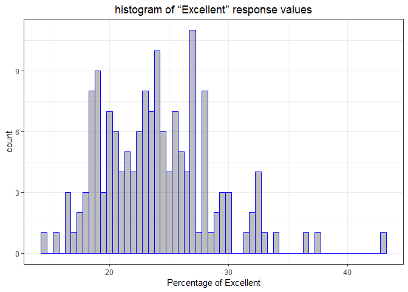
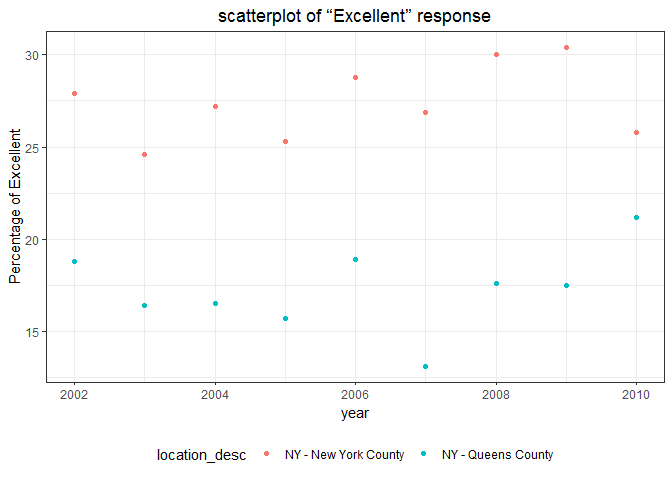

p8105\_hw2\_hh2767.Rmd
================
Haoran Hu
2018-09-30

Problem 1
=========

``` r
nyc_transit = read_csv(file = ".\\data\\NYC_Transit_Subway_Entrance_And_Exit_Data.csv") %>% 
  janitor::clean_names() %>% 
  select(line, station_name, station_latitude, station_longitude, route1:route11, entry, vending, entrance_type, ada) %>% 
mutate(entry = ifelse(entry == "NO", FALSE, TRUE))
```

    ## Parsed with column specification:
    ## cols(
    ##   .default = col_character(),
    ##   `Station Latitude` = col_double(),
    ##   `Station Longitude` = col_double(),
    ##   Route8 = col_integer(),
    ##   Route9 = col_integer(),
    ##   Route10 = col_integer(),
    ##   Route11 = col_integer(),
    ##   ADA = col_logical(),
    ##   `Free Crossover` = col_logical(),
    ##   `Entrance Latitude` = col_double(),
    ##   `Entrance Longitude` = col_double()
    ## )

    ## See spec(...) for full column specifications.

``` r
head(nyc_transit, 5)
```

    ## # A tibble: 5 x 19
    ##   line  station_name station_latitude station_longitu~ route1 route2 route3
    ##   <chr> <chr>                   <dbl>            <dbl> <chr>  <chr>  <chr> 
    ## 1 4 Av~ 25th St                  40.7            -74.0 R      <NA>   <NA>  
    ## 2 4 Av~ 25th St                  40.7            -74.0 R      <NA>   <NA>  
    ## 3 4 Av~ 36th St                  40.7            -74.0 N      R      <NA>  
    ## 4 4 Av~ 36th St                  40.7            -74.0 N      R      <NA>  
    ## 5 4 Av~ 36th St                  40.7            -74.0 N      R      <NA>  
    ## # ... with 12 more variables: route4 <chr>, route5 <chr>, route6 <chr>,
    ## #   route7 <chr>, route8 <int>, route9 <int>, route10 <int>,
    ## #   route11 <int>, entry <lgl>, vending <chr>, entrance_type <chr>,
    ## #   ada <lgl>

This dataset contains variables that describe NYC transits. The variables are:lines, station names, station locations, the routes that the station serves, entry type, vendings, ADA compliances and so on. So far, I have selected the variables that we need, cleaned the variable names, and turned entry variable from character variable into logical variable. The dimension of the data set is 1868(rows)\* 19(columns). These data are not tidy, because in the columns "route1" to "route11" are just differnet values of the same variable.

``` r
distinct_stations = distinct(nyc_transit, station_name, line, .keep_all = TRUE) 
```

The code chunk above creates a data frame that contains distince stations. There are 465 distinct stations. 84 of the stations are ADA compliant.

``` r
etr_novending = filter(nyc_transit, vending == "NO")
no_vend_allow_etr = sum(etr_novending$entry) #number of no vending entrance that allow entry
num_etr_novending = nrow(etr_novending) #number of entrance that are without vending.
```

The proportion of station entrances/exits without vending that allow entrance is 0.377.

In the following part, I will reformat data so that route number and route name are distinct variables, and the dataset will become tidy.

``` r
tidy_nyc_transit = gather(nyc_transit, key = route_num, value = route_name, route1:route11) %>% 
  filter(!is.na(route_name)) %>% 
  distinct()
```

Next, I will select the stations that serve the A train, and count how many of them are ADA compliant.

``` r
station_serve_A = distinct(tidy_nyc_transit, line, station_name, .keep_all = TRUE) %>% 
  filter(route_name == "A")
```

Then, we know that the number of distinct station that serve the A train is 60, and among those stations, 17 are ADA compliant.

Problem 2
=========

``` r
wheel_trash = readxl::read_excel(".\\data\\HealthyHarborWaterWheelTotals2017-9-26.xlsx", range = "A2:N258") %>% 
  janitor::clean_names() %>% 
  filter(!is.na(dumpster))
wheel_trash$sports_balls = round(wheel_trash$sports_balls)
wheel_trash$sports_balls = as.integer(wheel_trash$sports_balls)
```

``` r
pptn_2017 = readxl::read_excel(".\\data\\HealthyHarborWaterWheelTotals2017-9-26.xlsx", sheet = "2017 Precipitation") %>% 
  janitor::clean_names() %>% 
  filter(!is.na(precipitation_in)) %>% 
  filter(!is.na(x_1)) %>% 
  mutate(year = 2017)

pptn_2016 = readxl::read_excel(".\\data\\HealthyHarborWaterWheelTotals2017-9-26.xlsx", sheet = "2016 Precipitation") %>% 
  janitor::clean_names() %>% 
  filter(!is.na(precipitation_in)) %>% 
  filter(!is.na(x_1)) %>% 
  mutate(year = 2016)

pptn = bind_rows(pptn_2016, pptn_2017)

pptn = filter(pptn, pptn$precipitation_in != "Month")
pptn$precipitation_in = as.integer(pptn$precipitation_in)
pptn_precipitation_in = tibble(pptn$precipitation_in)
pptn$precipitation_in = apply(pptn_precipitation_in, 2, function(x) month.name[x])
```

Problem 3
=========

First, I will tidy the data for problem 3. In the following code chunk, I will clean the names of the variables.

``` r
brfss_smart2010 = janitor::clean_names(brfss_smart2010)
colnames(brfss_smart2010)[2] = "location_abbr"
colnames(brfss_smart2010)[3] = "location_desc"
```

Next, in the following code chunk, I will finish the following steps: Select the data whose topic is "Overall health". Exclude variables for class, topic, question, sample size, and everything from lower confidence limit to GeoLocation. Structure data so that values for Response (“Excellent” to “Poor”) are column names / variables which indicate the proportion of subjects with each response. Create a variable called "above\_good" that shows the proportion of responses that were “Excellent” or “Very Good”.

``` r
brfss_smart2010 = filter(brfss_smart2010, topic == "Overall Health") %>% 
  select(-class, -topic, -question, -sample_size, -(confidence_limit_low:geo_location)) %>% 
  spread(key = response, value = data_value) %>% 
  janitor::clean_names() %>% 
  select(year, location_abbr, location_desc, poor, fair, good, very_good, excellent) %>% 
  mutate(above_good = very_good + excellent) 

#if need to change the percentage to decimal
# brfss_smart2010$poor = lapply(brfss_smart2010$poor, function(x) x/100)
# brfss_smart2010$fair = lapply(brfss_smart2010$fair, function(x) x/100)
# brfss_smart2010$good = lapply(brfss_smart2010$good, function(x) x/100)
# brfss_smart2010$very_good = lapply(brfss_smart2010$very_good, function(x) x/100)
# brfss_smart2010$excellent = lapply(brfss_smart2010$excellent, function(x) x/100)
# brfss_smart2010$above_good = lapply(brfss_smart2010$above_good, function(x) x/100)
```

Use the following code chunk to find out how many location and how many different states are represented in the dataset, and also count how many times each state is observed.

``` r
#number of distinct locations
num_diff_loc = nrow(distinct(brfss_smart2010, location_desc))
#number of different states
num_diff_state = nrow(distinct(brfss_smart2010, location_abbr))

#to see what state is observed the most
state_count = count(brfss_smart2010, location_abbr) %>% 
  arrange(n)
```

From the information above, we know the number of unique locations that are included in the dataset is 404. In total, 51 states are represented. Since there are only 50 states and 1 special administrative region in the US, we know that every state is represented. NJ is observed the most, and it's observed for 146 times.

In order to figure out what the median of the “Excellent” response value is in 2002, I first filtered the data of 2002 , and then I calculated the median of the “Excellent” response value. This process is completed by the following chunk.

``` r
#to figure out the median of the “Excellent” response value in 2002
brfss_smart_only2002 = filter(brfss_smart2010, year == 2002)
median_excellent_2002 = median(brfss_smart_only2002$excellent, na.omit(TRUE))
```

Then, we know the median of the “Excellent” response value in 2002 is 23.6.

The following chunk creates a histogram of “Excellent” response values in the year 2002.

``` r
ggplot(brfss_smart_only2002, aes(x = excellent)) + 
  geom_histogram(alpha = .4, binwidth = .5, color = "blue") + xlab("Percentage of Excellent") +
ylab("ABNAS language") + ggtitle("histogram of Excellent") + theme(plot.title = element_text(hjust = 0.5)) +  theme_bw() + 
  theme(legend.position = "bottom")
```

    ## Warning: Removed 2 rows containing non-finite values (stat_bin).



``` r
brfss_NY_Q_county = filter(brfss_smart2010, location_desc == "NY - New York County" | location_desc == "NY - Queens County")
ggplot(brfss_NY_Q_county, aes(x = year, y = excellent)) + 
  geom_point(aes(color = location_desc)) + ylab("Percentage of Excellent") +  theme_bw() + 
  theme(legend.position = "bottom")
```


